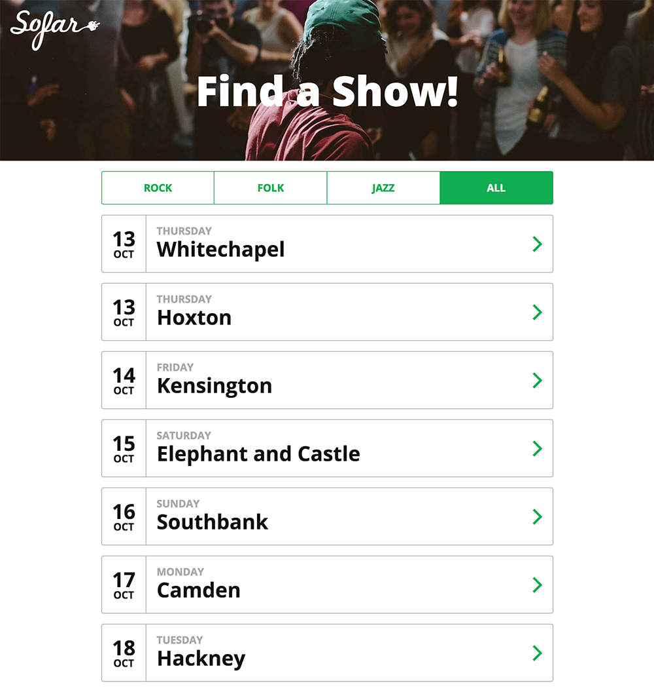

## Front-End Tech Test

We'd like you to build a list of shows that can be filtered by genre. You can use whatever frameworks or libraries you wish,
there are starter templates for Vanilla JS, jQuery and React in separate branches on this repository. It shouldn't take more than a couple of hours to complete.

Please commit to git as you go so that we can see your workings, and submit as a git repo when finished.

On initial load 'All' should be pre-selected, and all shows should be shown.

Subsequently, if a genre filter is selected, only shows of that genre should be shown.

----------------------------

In this repo you will find:

#### Mock Data

A JSON file with some shows. It has been structured specifically for the design shown.

`./data/shows.json`

#### Images

In `./img` you will find the Sofar Sounds logo, a banner image for the header and the arrow icon.

## Resources

- Typeface: [Open Sans](https://fonts.google.com/specimen/Open+Sans)
- Brand Color: `#10ad52`
