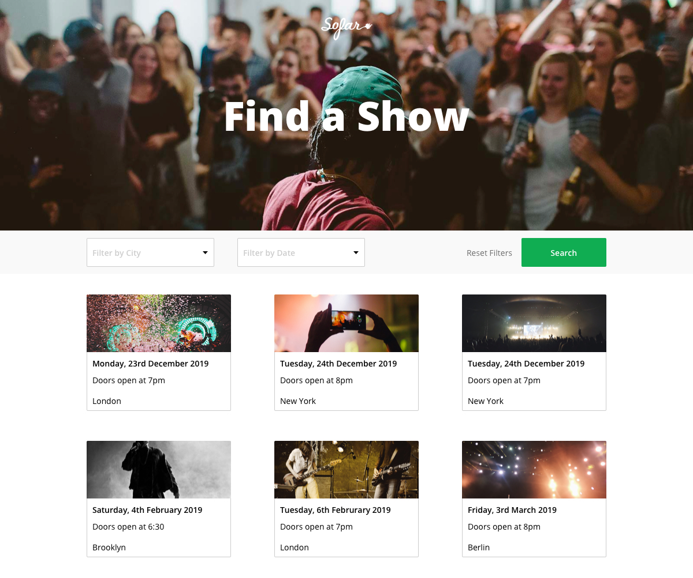

# Sofar Sounds Tech Test

The product manager has asked you to build a production ready listing page. Please read the
instructions carefully and do not spend more than one evening on it. Whatever you can't complete
in time, please write up a quick readme file with what you would have done in addition.

Please make sure you include instructions on how to run your project.

## What you will be building



## Product Requirements
- The application should match the design mockup above
- On initial load, no filters should be active and all events should be displayed
- To filter the events, the user has to click the "search" button
- The user can filter by both city and date at the same time
- The "Reset Filters" button only appears when at least one filter is active
- Clicking on "Reset Filters" removes all currently active filters
- When the user clicks on an event card they are redirected to the sofar sounds event page

## Tech Requirements
- Please use React (create-react-app is a great starting point)
- It should be typed (Typescript or Flow)
- When the events are filtered, no new request is being made to the API
- The application should be tested to a degree you feel is necessary for production
- If you can, dockerise the app

You can use anything for styling, however we use [https://styled-components.com](styled-components)
for the new generation frontend.

## API Documentation

You will be developing against our staging api which has some demo data setup.

**Request**
```
curl -k -X POST -H "Content-Type: application/json" -d '{"query": "{ events(page: 1, perPage: 2) { events { id guestsArriveAt startsAt endsAt price imageUrl city { id title } } } }"}' https://dev.sofarsounds.com/api/v2/graphql
```

**Example Response:**
```
{
  "data": {
    "events": {
      "events":[
        {
          "id": 1709,
          "guestsArriveAt": null,
          "startsAt": "2009-03-15T12:00:00Z",
          "endsAt": null,
          "price": 13.0,
          "imageUrl": "//dax2lgcd0wbaz.cloudfront.net/assets/event/bkg-event-header-d08f1c0b25ba5df9d48ae68f21ccb013701bc7023645a25ad281ae669ce7a0f3.jpg",
          "city": {
            "id": 48,
            "title": "London"
          },
        },
        {
          "id": 1710,
          "guestsArriveAt": null,
          "startsAt": "2009-05-15T11:00:00Z",
          "endsAt": null,
          "price": 20.0,
          "imageUrl": "//dax2lgcd0wbaz.cloudfront.net/assets/event/bkg-event-header-d08f1c0b25ba5df9d48ae68f21ccb013701bc7023645a25ad281ae669ce7a0f3.jpg",
          "city": {
            "id": 48,
            "title": "London"
          },
        },
      ]
    }
  }
}
```

## Assets
In this repository you will find the assets required to replicated the design attached:

- `./img`: The Sofar Sounds logo and a banner image for the header

## Brand
- Typeface: Open Sans
- Brand Colour: #10ad52
